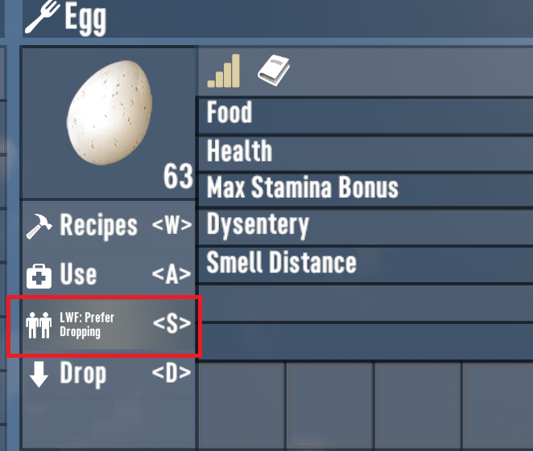
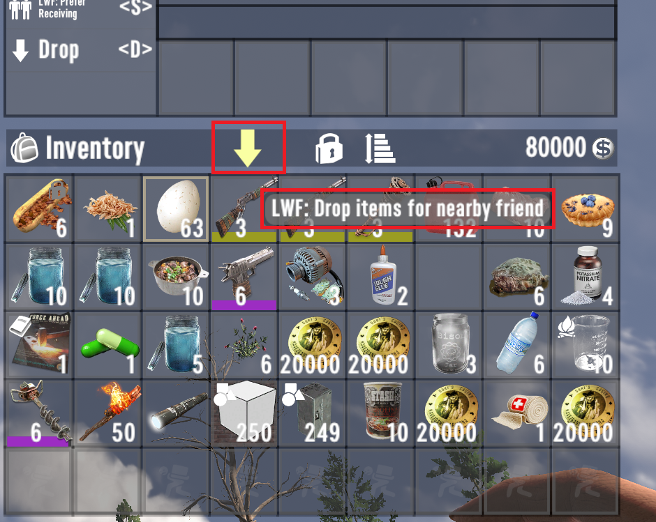
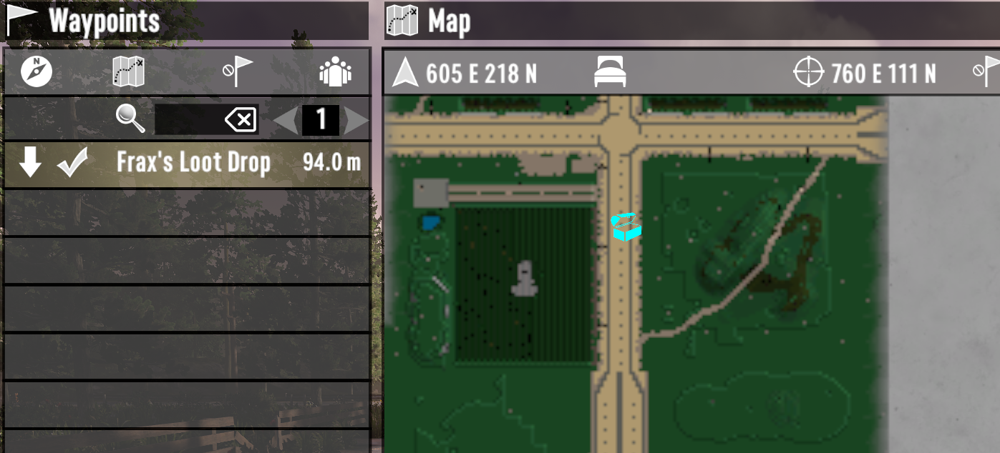

# Loot With Friends
Loot With Friends is a 7 Days To Die mod designed to help make looting with a friend easier. It was created for 7D2D v2.5.

https://github.com/jfrax/LootWithFriends

When looting together with an ally and you become encumbered, it usually makes sense to consolidate your inventories periodically. Loot With Friends allows you to define which stackable loot items you typically drop vs which ones you keep when looting with friends, so that you can quickly drop a loot bag for your ally with one click.

## How It Works
In the inventory UI, an action button is added alongside the vanilla buttons to allow you to change preferences for each item by toggling between three states:
* Prefer Dropping
* Prefer Receiving
* No Preference

Note that this button only appears for items which can be stacked.

Another button is added to the backpack UI:

When clicking this button, your preferences are checked against the preferences of your nearest ally:
1. If you prefer to drop an item, it will always be dropped
2. If you prefer receiving an item, it will never be dropped
3. If you have no preference set for an item, but your ally prefers receiving it, it will be dropped

Items meeting the above criteria for dropping will be put into a loot bag and dropped at your feet. Please note that this **requires trust** with your ally!

The mod respects locked item slots, and those should never be dropped.

A waypoint will also be created for the ally you dropped it for so that they can easily find it.

Note that there is also a `Preferences.json` file that lets you set a couple of options:

* **CreateWaypointsForBagsIDrop** (default false) - If true, creates a waypoint marker for your own dropped bags. These have a different icon/color than bags dropped for you by your allies.
* **CreateWaypointsForBagsFriendsDrop** (default true) - If true, creates waypoints as shown in the screenshot above for loot bags dropped for you by your allies
* **AllowDropWhenNoAlliesPresent** (default true) - If true, and there are no allies presently on the server, it will still drop a loot bag with all the things you have indicated you prefer to drop.

# Installation
This mod uses code and therefore requires that 7D2D be launched with **EAC (Anticheat) disabled!**
Unzip, and put the contents inside your game directory, here `\7 Days To Die\Mods`. In the end, the folder structure should be like this `\7 Days To Die\Mods\LootWithFriends`, with the .dll inside there.

It must be installed on the server(/host), and on all clients using the feature.

# Localization
I attempted to add localization for all supported languages with the help of AI, but I'm not sure about the quality of the translations. If you find anything wrong or confusing, please let me know.

# Final Notes
Thank you for checking out my mod!
I created this for me and my wife; we love this game and come back for a playthrough periodically, but always end up with the same gameplay loop when we're out looting: "oh, I'm encumbered - let's swap items", and we'd sit there and look at each other's screens, dropping things that the other already had partial stacks of. The approach we would usually take is to just have a few geenral rules, like _i always take iron/brass/scavenged materials_, and _you always take food items, seeds, bones, etc_. I briefly considered making a more automated/sophistocated approach to balancing items so that our inventories could be perfectly balanced with a single click, but ultimately, that seemed like it would be a bit game-breaking/immersion-breaking, and at that point it might just be better to go with an inventory size cheat or something. My goal here was to keep vanilla pack sizes, but allow us to do what we were already doing a bit quicker 😊

Although I have tested it pretty extensively in our setup (peer to peer on the same network), I have not been been able to test this on a dedicated server, or in games with more than two players. If you encounter any bugs or issues, please let me know and I'll do my best to address them.

